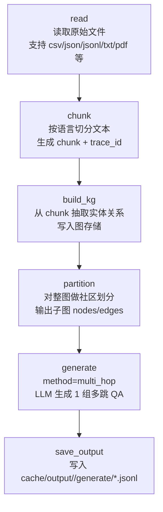

# Generate Multi-hop QAs

## Multi-hop 全流程梳理（基于当前配置）

当前 `multi_hop_config.yaml` 的 DAG 是：`read -> chunk -> build_kg -> partition -> generate(multi_hop)`。



## 每一步输入输出（简版）

1. `read`
   - 输入：`input_path` 指定的数据源
   - 输出：统一数据记录（含 `_trace_id`）

2. `chunk`
   - 输入：`read` 的文本记录
   - 输出：chunk 列表；每个 chunk 附带语言和长度元数据

3. `build_kg`
   - 输入：chunk
   - 输出：实体/关系抽取结果并合并进图数据库（kuzu/networkx）

4. `partition`
   - 输入：全量知识图
   - 输出：多个社区子图（`nodes` + `edges`）

5. `generate`（`method: multi_hop`）
   - 输入：每个社区子图
   - 输出：问答对（ChatML）

## 可直接喂给画图模型的 Prompt

你可以把下面这段 prompt 直接给 Mermaid/Draw.io/Whimsical/LLM 画图工具：

```text
请为一个“多跳问答数据生成流水线”绘制专业流程图（自上而下），要求：

1) 使用 6 个主节点，并按顺序连接：
   read -> chunk -> build_kg -> partition -> generate(multi_hop) -> save_output

2) 每个节点文案：
- read: 读取原始文件（csv/json/jsonl/txt/pdf），输出统一记录与 trace_id
- chunk: 按语言切分文本（chunk_size=1024, overlap=100），输出文本块和元数据
- build_kg: 从 chunk 抽取实体与关系，写入知识图存储
- partition: 对整图进行社区划分（ECE），输出子图 nodes/edges
- generate(multi_hop): 基于每个子图调用 LLM 生成 1 组多跳 QA（question+answer）
- save_output: 保存为 ChatML/JSONL 到 cache/output/<run_id>/generate/

3) 视觉风格：
- 工程架构风（简洁、学术）
- 主流程使用实线箭头
- 每个节点底部增加一行“输入/输出”摘要
- 在右上角加注释：运行框架为 Ray Data DAG，节点按依赖拓扑执行

4) 输出格式：
- 优先输出 Mermaid flowchart 代码
- 若工具不支持 Mermaid，则输出可导入 draw.io 的结构化描述
```
